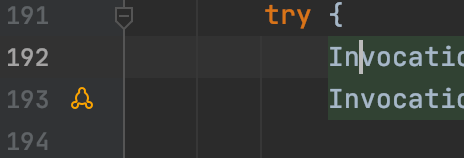

# Enable/Disable Tracepoint

When a tracepoint is disabled, it will not be removed but it will stop capturing snapshots. A disabled tracepoint can be enabled back again later till it gets expired. So, disabling a tracepoint is useful when you need to remove it temporarily.

To disable a tracepoint, uncheck the “Enabled” checkbox in the edit popup:

You can also use the On/Off button next to the tracepoint line on the main tool window to enable and disable tracepoints.

As it can be seen in the below image, disabled tracepoints will be shown using an outlined icon to visually separate them from the enabled ones:

\

\
