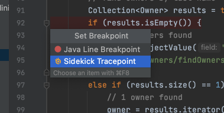
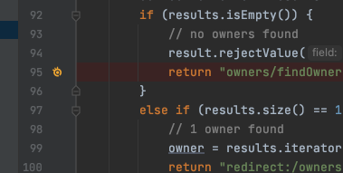

# Set Tracepoint

<iframe width="560" height="315" src="https://www.youtube.com/embed/y7LUcyF5jp8" title="YouTube video player" frameborder="0" allow="accelerometer; autoplay; clipboard-write; encrypted-media; gyroscope; picture-in-picture; web-share" allowfullscreen></iframe> 

Setting up a tracepoint helps developers understand code execution on specific parts of an application. It’s as easy as setting up an ordinary line breakpoint with just one click on the gutter area.

Since there are multiple types of breakpoints that can be set on that line, namely a Java breakpoint and a Sidekick tracepoint, IntelliJ IDEA will show you a small popup with a list of possible breakpoint types:

Note that the Sidekick tracepoint option is only available if you are already connected and have clicked on a line containing a valid expression inside a method.

When you select  “Sidekick Tracepoint”, you see a gray tracepoint icon for a second until it is synced to the remote application, it then becomes yellow when the connection with the remote application is set.

Note that you are only setting a tracepoint to the application instances visible on the main Sidekick tool window. So, the tracepoint can be created on multiple application instances once, but if an application instance is hidden on the main tool window, the tracepoint will not be created there.

If the tracepoint is created on all of the selected instances, you will see the following success message:

If the tracepoint is created on some (but not all) of the instances, you will see the success message and error details together. For example, if you attempted to put a tracepoint on three instances, but two of them doesn’t contain the target class, you will see the following notification:

Note that the numbers indicate the instance counts where the corresponding error occurred.
If the tracepoint couldn’t be created on any of the instances, you will see the following error message:

After setting your first tracepoint, you can start browsing the tracepoint events as explained [here](../tracepoint-events/). 
