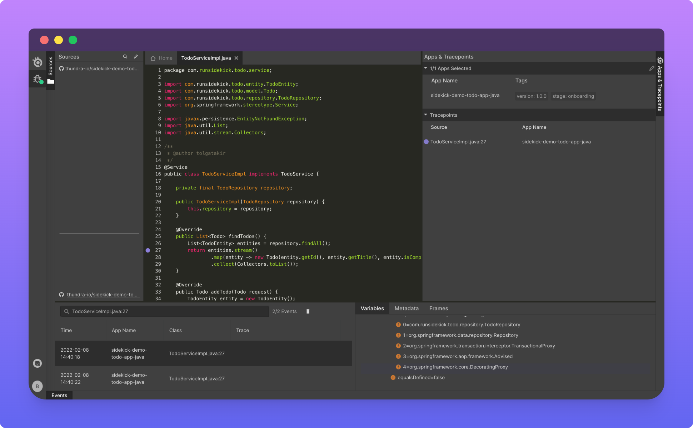

# 🏃♀ Quick Start: To-Do App

### Option 1: Sandbox

We have prepared a sandbox environment for you  to try Sidekick without Sign-up and installing any dependency. You can try it from here:

<figure><figcaption><p><a href="https://app.runsidekick.com/sandbox?utm_source=github&#x26;utm_medium=docs">GO TO SANDBOX</a></p></figcaption></figure>

### Option 2: Example Setup

This example provides the steps to deploy a simple To-Do app with Docker and debug using Sidekick. It includes:

* [Connecting a source code from a public GitHub repository](quick-start-todo-app.md#1st-step-connect-the-sample-source-code)
* [Run a Sidekick agent installed To-Do app using Docker container](quick-start-todo-app.md#2nd-step-run-a-sidekick-agent-installed-to-do-app-using-docker-container)
* [Putting a tracepoint](quick-start-todo-app.md#4th-step-open-source-file-and-put-tracepoint)
* [Generating a tracepoint event](quick-start-todo-app.md#5th-step)
* [Analyzing the snapshot](quick-start-todo-app.md#6th-step)

After completing this example, you'll have an up and running app that can be debugged with Sidekick.

Therefore, we have designed a tailored experience for you to understand how Sidekick works with a simple To-Do application.&#x20;


### **1st step: Connect the source code**

<figure><figcaption></figcaption></figure>

We will use our demo-todo-app for this tutorial. You can fork it from here:

[https://github.com/runsidekick/sidekick-demo-todo-app-java](https://github.com/runsidekick/sidekick-demo-todo-app-java)

It's essential for Sidekick agents to know which branch/code you want to debug. By connecting your source code, you allow Sidekick to understand the correct source code and the correct tracepoint location.


**Sidekick has only read-only access to your source code and never brings it to servers and keeps it in your browser.**  &#x20;


Learn more about connecting your source code


[import-source-code.md](how-to/import-source-code.md)



### **2nd step - Run a Sidekick agent installed To-Do app using Docker container** &#x20;

Instrumenting ToDo app with Docker. For this step, Docker needs to be initialized on your system.&#x20;

Download the Docker image using:

```bash
docker pull runsidekick/sidekick-demo-todo-app-java:latest
```

Run in your local:

```bash
docker run -e SIDEKICK_APIKEY=<YOUR-API-KEY> \
-e SIDEKICK_AGENT_BROKER_HOST=wss://broker.service.runsidekick.com -p 8080:8080 \
runsidekick/sidekick-demo-todo-app-java:latest
```

Learn more about instrumenting your own application:


[configuration.md](../../agents/java/configuration.md)



### 3rd Step - Application selection

Apps need to be selected to start debugging. When you click "Select Application For Me" you will be able to start debugging.

<figure><figcaption></figcaption></figure>

### 4th Step - Open source file and put tracepoint

Sidekick will capture the snapshot when you add a task on To-Do app. For this purpose, you will open `ToDoServiceImpl.java` file and add a tracepoint on 27th line. Right click on that line select Add Tracepoint. Then press the Add button to put your first tracepoint.

<figure><figcaption></figcaption></figure>

<figure><figcaption></figcaption></figure>

### 5th Step - Executing your code and generating a snapshot

Your app needs to be up and running at `localhost:8080` Open your To**-**Do app and add a task.&#x20;


### 6th Step - Analyzing your snapshot

You will see the events generated when you add a task. In order to see events panel, click on a **collected event.**

<figure><figcaption></figcaption></figure>

****

<figure><figcaption></figcaption></figure>

### Final

Your snapshots events will be listed on the bottom panel and you can click the generated events. &#x20;



You are all set!
