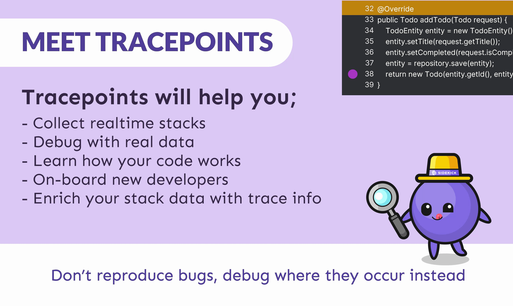

# 🔎 Tracepoint

Put tracepoints in your code and instantly see the snapshots of the application state, the call stack, captured variables, etc. without stopping the application.

A tracepoint is basically a non-breaking remote breakpoint. Tracepoints differ from ordinary breakpoints in two ways:

* First, it doesn’t pause the code execution but just takes a screenshot of the variables when the code hits that line.
* Second, it’s integrated with Thundra’s distributed technology enabling the connection between several tracepoints in the same transaction.

## How to use tracepoints:

### Put Tracepoint

<iframe src="https://pitch.com/embed/1f513642-fa27-40ad-95d2-3a41a1a12829" allow="fullscreen" allowfullscreen="" width="560" height="368"></iframe>

### Observe Tracepoint Events

<iframe src="https://pitch.com/embed/5519d96f-bd5a-4add-8244-d99746576019" allow="fullscreen" allowfullscreen="" width="560" height="368"></iframe>

### Enable/Disable Tracepoint

<iframe src="https://www.loom.com/embed/11b7ad08f69c4534997af1ace6f5c124" frameborder="0" webkitallowfullscreen mozallowfullscreen allowfullscreen></iframe>

### Edit Tracepoint

<iframe src="https://pitch.com/embed/7b53173e-06b4-41ac-aa6d-f305cead7702" allow="fullscreen" allowfullscreen="" width="560" height="368"></iframe>

### Delete Tracepoint

<iframe src="https://www.loom.com/embed/5c2e7b58c6904bdca97f53cb3e94670a" frameborder="0" webkitallowfullscreen mozallowfullscreen allowfullscreen></iframe>

###

###

